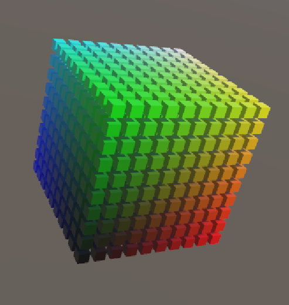
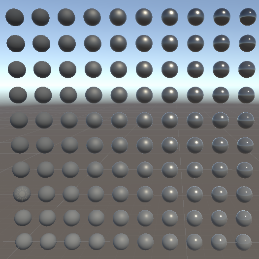

# Lab week 1

 Open the "week_01_csharp" folder from unity hub.

 All exercises are implemented as scenes. Open the relevant scene for each exercise, and implement your solution there.

 ## Exercise one : debug camera

 In this scene, the camera has a ScriptComponent attached. The script moves the camera forward when the "W" key is pressed. 

 ### Extend the script to use "S" to move backwards
 
 Look at how "W" is implement

 ### Extend the script to use "A" and "D" for left and right
 
 This will involve using a different axis of the TransformComponent

 ### Extend the script to pitch up and down

 The camera should pitch up and down when the following conditions are met:

 1. The right mouse button is held down
 2. The mouse moves up or down

 ### Extend the script to yaw left and right

 The camera should yaw left and right when the following conditions are met:

 1. The right mouse button is held down
 2. The mouse moves left and right

 ### Extend the script with conditional speed

 1. Make the camera move 10x faster when SHIFT is held down
 2. Make the camera move 10x slower when CTRL is held down

 ### Make the camera movement framerate independent

 Right now, our camera moves faster with a higher framerate. Make it so it always moves at the same speed, independent of the current framerate.

 ### Motivation

 This is actually a useful script for your future projects, so remember you have it when you feel the need to move around your scene's at runtime.

 ## Exercise two : color cube

 

 Here we will learn how to instantiate GameObject's, as well as do some basic positioning in space

 There is a GameObject in the Scene called CubeSpawner. It has an attached script, which instantiates one cube. 

 ### Create a 3D grid of cubes

 Make the grid have 10 cubes on each axis, and reserve some space between the cubes.

 ### Make the cubes have color depending on their coordinate

 Starting from black, increase the red color component across the X axis, green along y, and blue along z.

 ##  Exercise three : material wall

 

 Here we will learn how to modify Material parameters, and see what the range is of the default material.

  ### Create a 2D grid of spheres

 Create an empty GameObject called SphereSpawner in the Scene. Give it a ScriptComponent that has a script called SphereSpawner. Make is create a row spheres along the X  axis.

 ### Vary the two main material parameters

 The parameter we're interested in is Smoothness. Vary Metallic along the X axis.

 ### Motivation 

 This exercise teaches you a very simple but effective way to see what a material is capable is doing. This works especially well if a material has more than one parameter (in that case we can just drag a slider).
 