# Lab week 2

 Open the "week_02_spaces" folder from unity hub as a project

 There is only one scene for this lab, called "Exercise 1"
 
 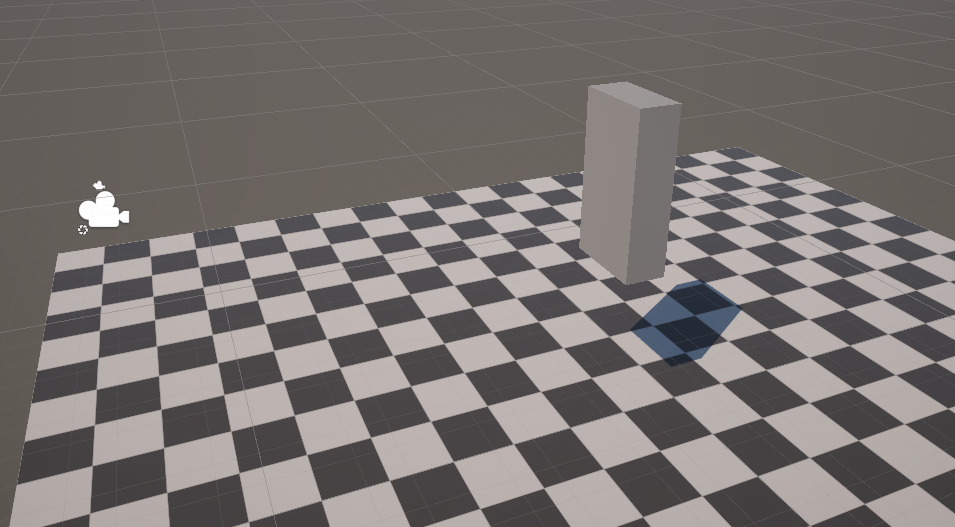

 In this lab, we will be implementing a very simple "character editor". We will construct a character out of boxes, and have a gui to change the appearance at runtime. We will also implement several animations, and add some other life to our character.

 When you press the play button, you will see that part of this gui is already implemented

 
 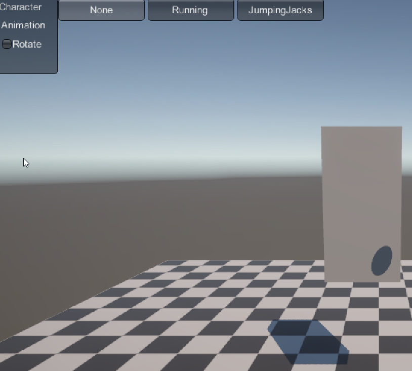

 The rotate button slowly rotates our character. It's a useful thing to enable to check that your math check's out, everything should work independent of the rotation and position of the character. If it's in the way, you can move it out of the way for now, but make sure to put it back.

 There's also 3 radio buttons referring to animations we'll be creating. Right now the don't do anything.

 The animations are implemented in a [GUI framework called IMGUI](https://docs.unity3d.com/Manual/GUIScriptingGuide.html). This is not a GUI you would usually ship to customers, but it is very commonly used (I have never not seen it beings used) when implementing a quick and dirty debug interface. The reason is that using IMGUI allows us to add UI and use their result in a very short amount of code, often only one line of code. For example, the following code (which you can find as **CharacterGUI**, a script attached to **Character GameObject**)
 
 ~~~
isRotation = GUI.Toggle(new Rect(25, 50, 100, 30), isRotation, "Rotate");
 ~~~

 This is implemented inside the **Update** method. It's the only code we need to have a button, and have it's toggle state reflected as a boolean each frame. Not directly relevant to our course, but it pretty neat!

 But let's get started for real

 ## Add a leg 

 Add another cube to the character:

 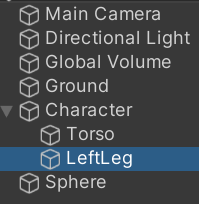
 
 Use the following settings for the transform: 

 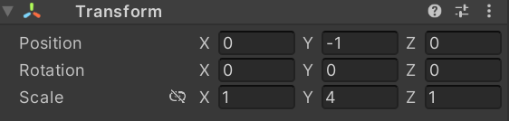
 
 You should end up with a result that looks like this : 
 
 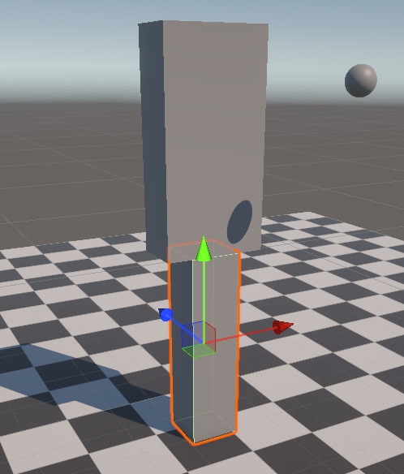

Good enough for now, but doublecheck that the characters stays consistent with any rotation and scale. (It should! Although if you scale larger along the Y axis, you will notice the leg disappears under the floor).

## Animating the leg

We want to swing the leg back and forth, similar to characters in minecraft. That means we have to rotate them back and forth (bonus exercise: which axis should we rotate over? don't read on).

Let's first manual check that our leg is set up correctly for that rotation. Select the leg GameObject, and rotate it in the correct direction.

This is my result : 

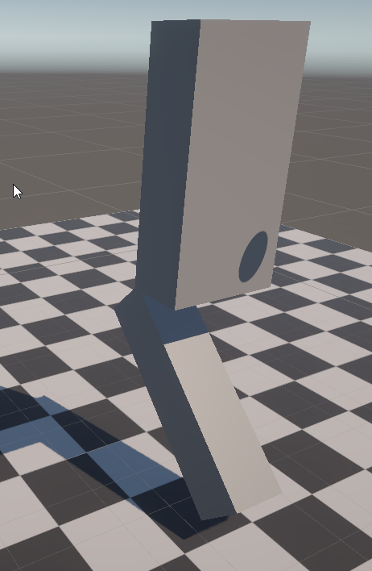

Which is unfortunate :( 

It should be apparent what is happening: our leg is rotation around the center of the cube it's build with. 

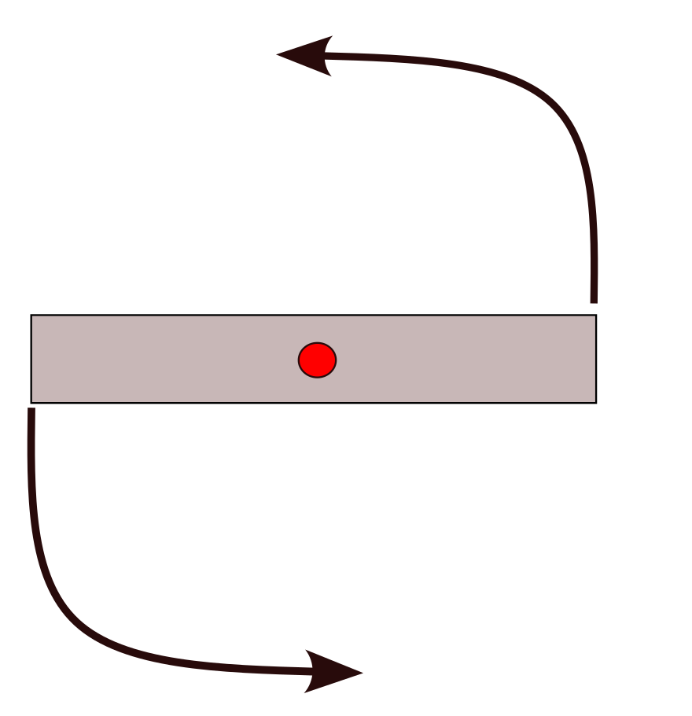

The red point is called the **pivot**. And we would like it to be where the leg connects to the torso, so we can get the swing we want.

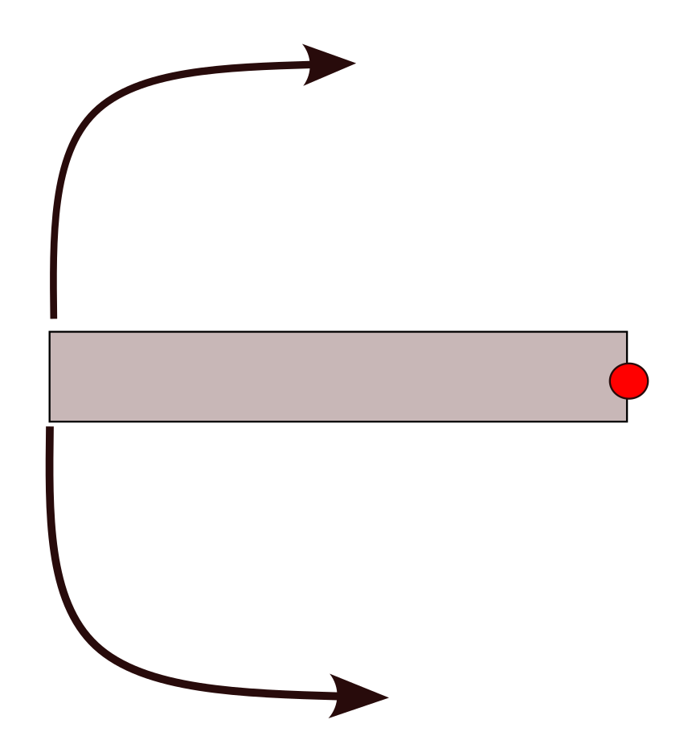

The easiest way to change the pivot, is to add an empty **GameObject** on the position we want our pivot. That way, we move the cube relative to that empty object, and rotate that object with the correct pivot:

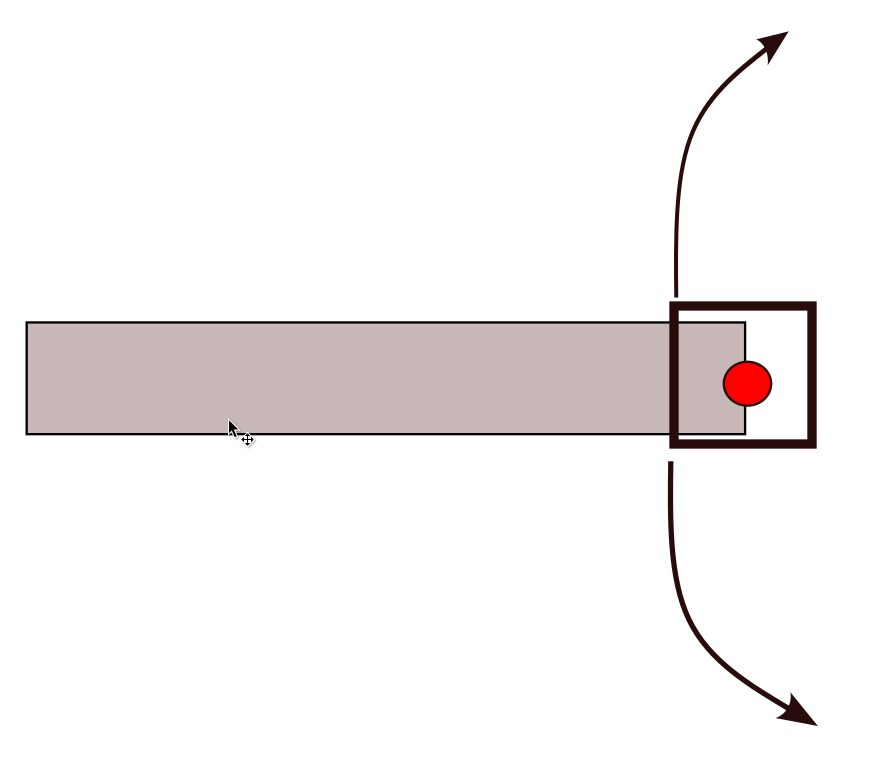

Add your empty object as a child of the Character, and add your leg as a child of empty object (I called it LegPivot). Add your leg to the pivot. Set the pivot on the pelvis of the torse, at the point you want to rotate. !!! DANGER !!! Unity will put the gizmos on the center of the leg, even if you have the pivot is selected. I had to type in the correct transform for the pivot into the TransformComponent UI.

After everything is set, try rotating the pivot point. You should be able to do see something similar to this : 

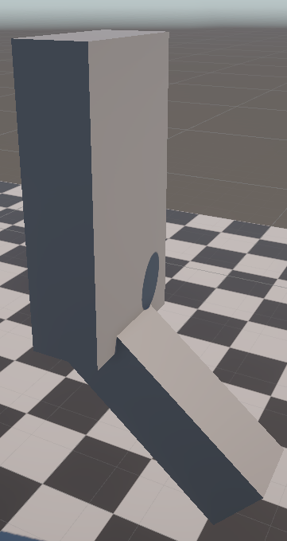

Feels good!

We're almost done, now we do have to animate it properly. We want a function that goes back and forth smoothly. Luckily, I've already set this up the Sphere. Have a look at how that scripts work, and create a new script to animate the leg so it goes back and forth automatically.

## Create the second leg

Having one leg is a bit awkward, so add a second leg. Make Follow the same steps as the first one. You'll have to move the first leg to the side, we don't want one leg in the middle and the other hanging on on the side :)

One gotcha is that to animate the walking, we want it to be opposite (if one leg is in front, the other one is in the back). Do not make a new script for the other leg. Use a c# property to add an offset to the script, and configure that offset in the inspector window (where you can see the components of a GameObject)

## Add arms, and animate them as well

Simply do the same as the legs. You can add more properties to the script if you feel you need it, but it should be very straightforward.

## Add a walking speed to the UI

Create a slider in the ui that controls how fast the character appears to be walking. At slower speeds, make sure the character swings their arms and legs in a smaller arc. This could be a good place to use C# event. Also, make sure to add a sane minimum and maximum to the sliders.

## Hook up the animation state to the UI

Right now the character is always walking. Make sure the character only starts walking when the walking animation is selected. If the "None" animation is selected, the character should return to the default pose.

## Add a "jumping jacks" animation

This is very similar to the walking animation, but, at the same time, the legs are animated to go outwards sideways, and the arms go upwards.

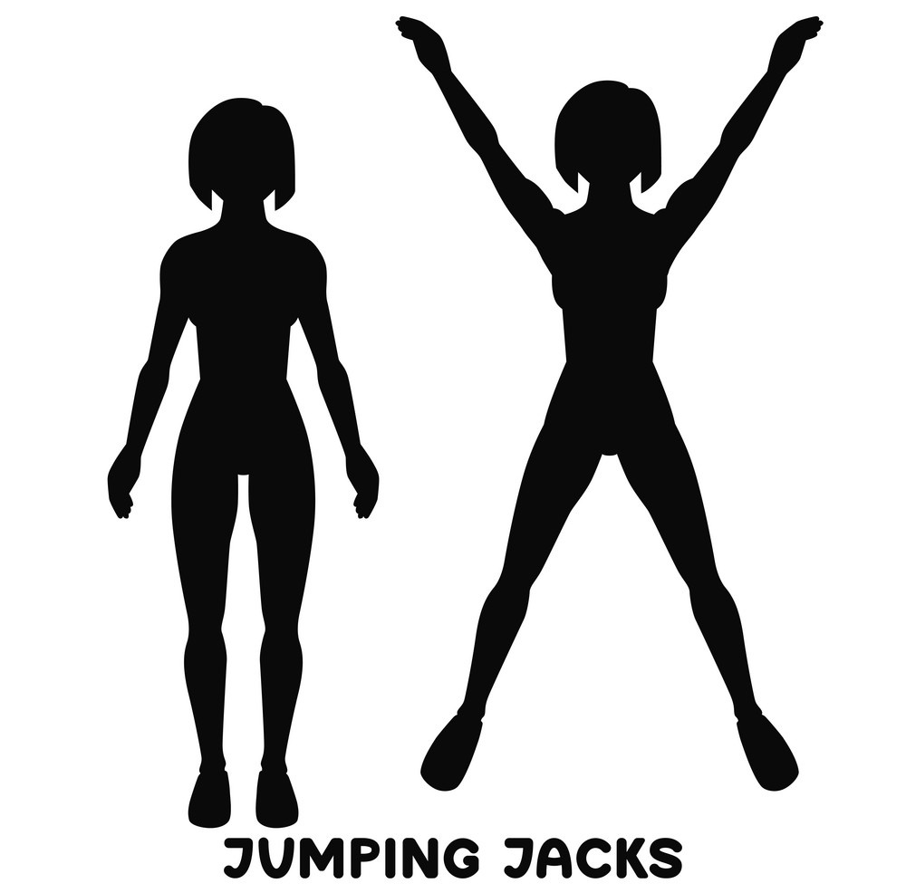

Hook it up to the correct ui buttons as well

## Add a head

Add two eyes to the head, and add pupils to each each. Make sure the stick out of the pupil a bit, so they're easy to see. I added a white material to the eyes to make them easier to see.

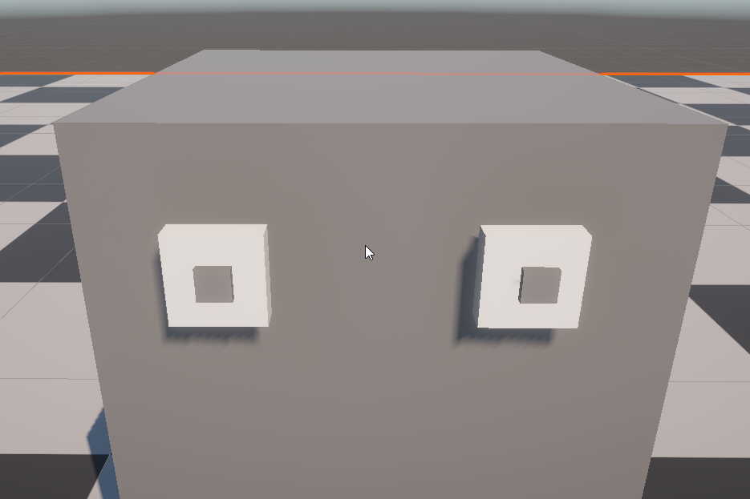

## Take a break, and have fun with it!

You've already done quite a bit of work. Consider adding some extra boxes, or creating some materials to make your character look better. Keep it within reason (I do need to evaluate it). But you can add a nose, ears, hear, etc.... Have fun with it. (This is not mandatory and won't be graded).

## Add a slider for leg length

Make it go from 50% to 200% from the default. Doublecheck you're animations don't break.

## Ground the character

Right now you have noticed the character might sink into the ground, or floats above it when you change  the length of legs. Figure out a way (without using physics) that, when the characters legs are straight down, he's standing correctly on the ground plane (bottom of the feet on the checkered square).

## Make the character look at the ball

This a bigger assignment. We want to make our character look at the ball. By "look at", we want there there to be a line connecting the centers of the ball, the pupil, and the eye itself.

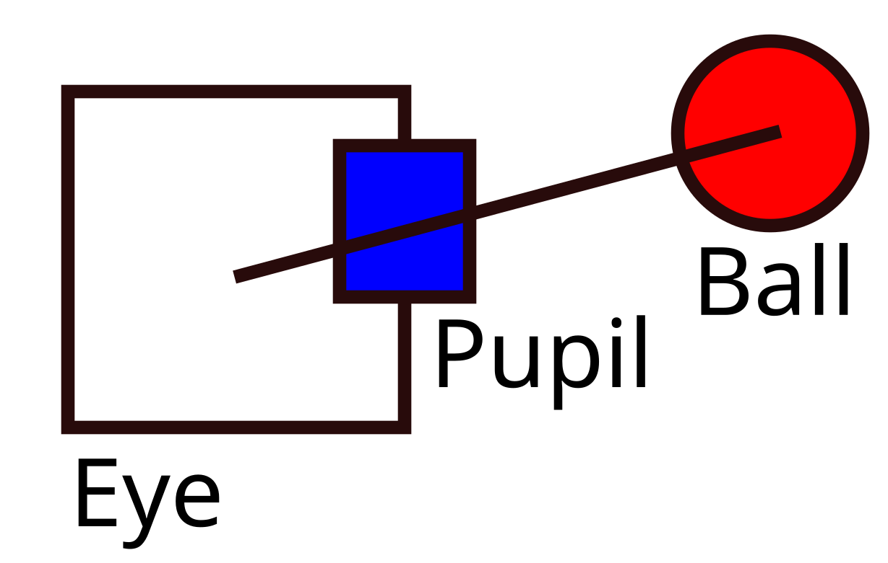

The algorithm to follow is the following:

1. Turn the pupils, but don't let them go out of the eyes (at least the center should stay in the eyes, on the side of the eye facing to the front)
2. If that isn't enough, turn the head, the minimal amount you need. But only do this if you've already turned the pupils the maximal amount.

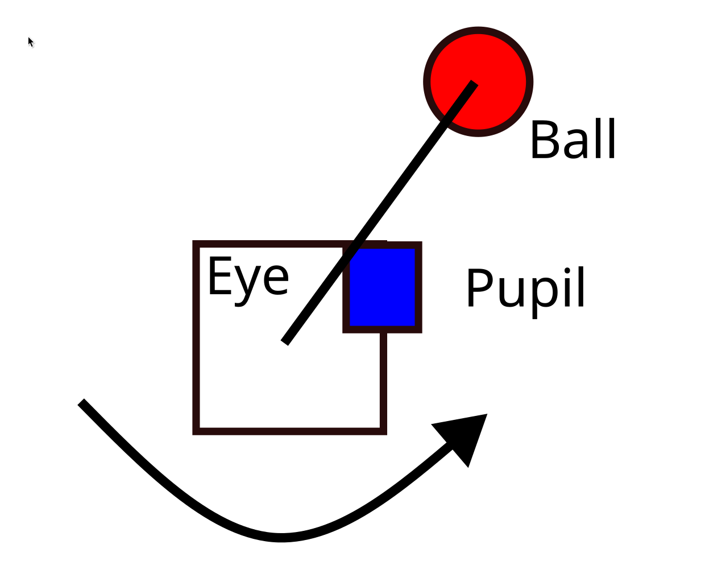
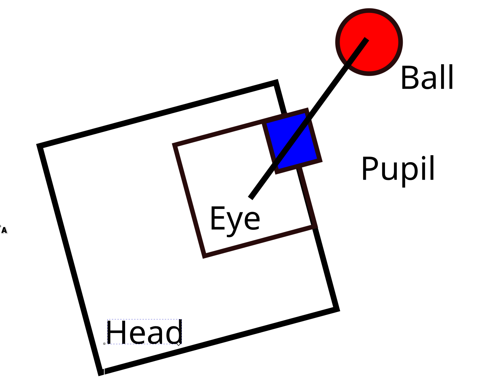

Remember, you can temporarily put the red ball in a fixed position (comment out the script) to make it easier to debug.

## Check your work

1. Scale the Character GameObject and check that everything still connects / animates and your tracking still works
2. Rotate the Character GameObject and check that everything still connects / animates and your tracking still works
3. Play with all slider's, animations, and place the ball in unexpected positions. Try to really break your character, and if you think it works, let someone else try to break it. 

Good luck, and have fun!