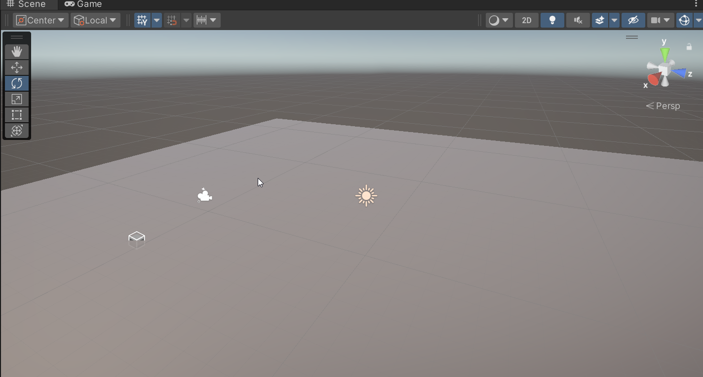
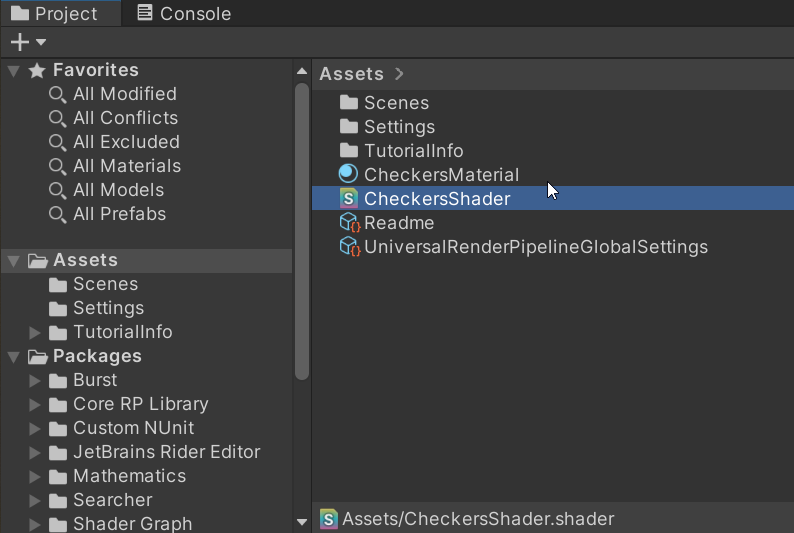
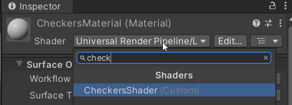
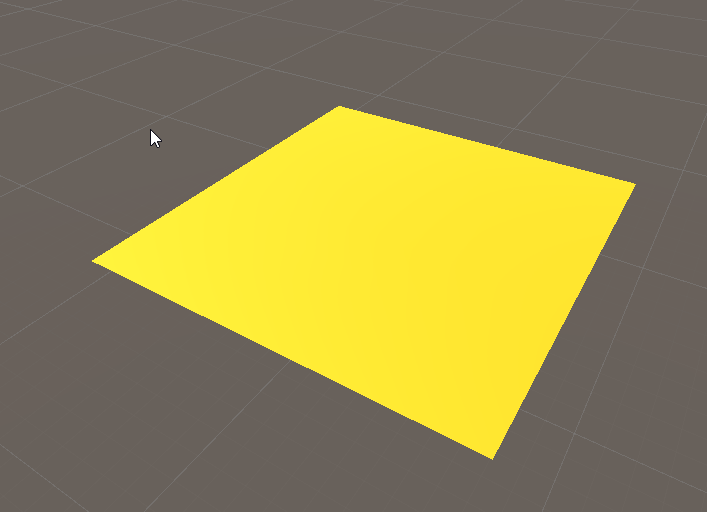
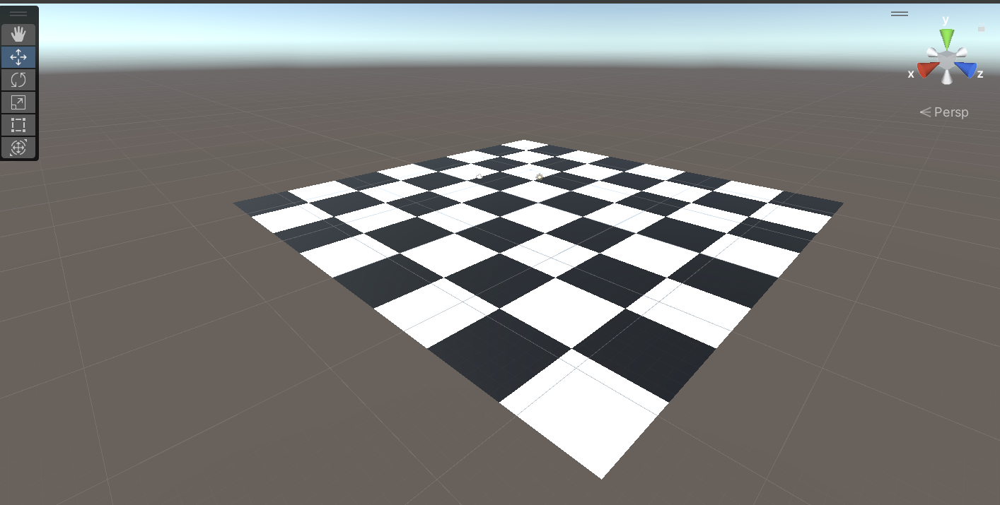
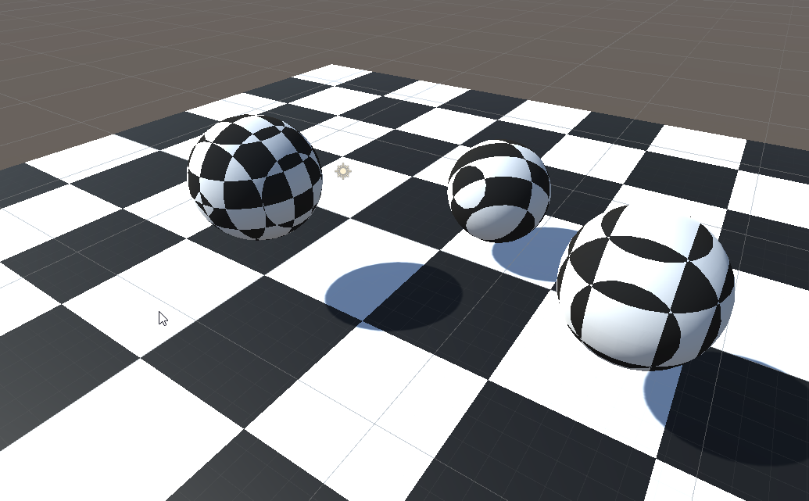

# Lab week 3

 Open the "week_03_pipeline_hlsl" folder from unity hub as a project

 There is only one scene for this lab, called "Exercise 1". If you open it, you should see a plain plane. 

 

 Let's give it a more interesting look by making it look like a chessboard.

 PS The shaders might look a bit different to what you've seen before. This is normal. We've used Unity's URP pipeline before, and for this class, we're using the default one. Both will be explained in the "Advanced Pipeline" class.

## Chessboard

 Start by creating a material and a Surface Shader (a text shader, **not** a graph).

 

 Don't forget to point the material to the shader.

 

 Open the the shader in your favorite text editor. We're going to try and implement a checkerboard. We'll start by making the "checks" arbitrarily.

You'll want to write your code in the fragment shader, called **surf()**. Right now it's trying to access a texture for the color:

```
 void surf (Input IN, inout SurfaceOutputStandard o)
 {
     // Albedo comes from a texture tinted by color
     fixed4 c = tex2D (_MainTex, IN.uv_MainTex) * _Color;
     o.Albedo = c.rgb;
     // Metallic and smoothness come from slider variables
     o.Metallic = _Metallic;
     o.Smoothness = _Glossiness;
     o.Alpha = c.a;
 }
 ```

Albedo is a fancy name for the color of an object not accounting for lighting. Remember, we are using a lit shader, so Unity is doing the lighting for us, we just provide it with the information it needs.
Albedo is part of the output struct. It's value is assigned as the value of the **tex2D** function. Get rid of it, and assign c as 

```
fixed4 c = float4(1,0.8,0.0,1);
```

It's weird we use a float4 for color. xyz and are interpreted as rgb (red green blue), but the last component, w, is a or alpha. Often, it's ignored, but it's safest to put it 1.0. Alpha is related to transparent, and the higher the alpha, the less transparent an object. An alpha of 0 means completely transparent, an alpha of 1 means not transparent at all.

You should get this result:



Now, we want to make a checkerboard from the plane. A checkerboard is alternating squares of 2 different colors, with each row / column offset from eachother.




Try and work out on paper / in your head how you would draw checkers algorithmically. Or you can write a quick script that prints black as X and white as 0.

The pattern isn't too hard to spot. Remember, you can use integers and bitwise operations in hlsl.

Start by hardcoding your pattern (hardcoded colors, hardcoded amount of checks in all dimensions). Think about which coordinates you want to use : local/object, world, view, uv coordinates... 

Once you've done that, add properties for colors, and the amount of checks.

Properties are implemented at the top of the file, in the properties block. 

```
 Properties
 {
     _Color ("Color", Color) = (1,1,1,1)
     _MainTex ("Albedo (RGB)", 2D) = "white" {}
     _Glossiness ("Smoothness", Range(0,1)) = 0.5
     _Metallic ("Metallic", Range(0,1)) = 0.0
 }
```

An annoying gotcha is that you can't access these in your shaders yet. For that, we have to declare them in the Pass (a Pass is a combination of a vertex and fragment shaders).

```
half _Glossiness;
half _Metallic;
fixed4 _Color;
```

You can find more information about properties, and examples for different data types, at the [documentation for properties](https://docs.unity3d.com/Manual/SL-Properties.html).

### 3D chess




Unfortunately, this course is not called 2D graphics, but 3D graphics. Let's extend our idea one dimensions.

Create a new Shader and Material for your 3D checkers.

#### World space
Start by adding a sphere, and try to implement a 3D checkers effect. You won't be able to use the uv coordinates. We'll end up implementing 3 different coordinates spaces, but let's start with the world position.

For that, we want to extend the Input struct that is a parameter to surf().

```
  struct Input
  {
      float2 uv_MainTex;
      float3 worldPos;
```

The keen eyed student might have noticed there is only one function here, even though I told you you always need to have a vertex and a fragment shader. The reason is that there is a vertex shader, you just can't see it. It's automatically generated from Unity. When the Unity shader compiler sees **worldPos**, it will assign the correct variable from the hidden vertex shader.

At this point, you should have enough to put checkers on your sphere in world space. Note that sphere's can be small, so if you see a solid color, try increasing the size of your sphere, or decrease the size of your checkers. The default sphere has a diameter of 1 unit, and if you don't specify the size of your checks your math will assume they're 1 unit wide.

To test your shader, move your sphere. It should look like your sphere is "swimming" in a fixed sea of 3D checks.

#### View space 

Add a second sphere. We're going to implement View Space check. But let's not make a new shader, extend your previous shader to accept an **int** property, so we can use it in a switch statement (unfortunately HLSL doesn't know about enums). Use the display string of the property to show which int does what.

```
_Space ("Space (object = 0, world = 1, view = 2", Integer) = 0
```

Implementation is similar to world space. You can find the correct variable in the [documentation for builtin variables](https://docs.unity3d.com/Manual/SL-UnityShaderVariables.html).

Check your work by moving the camera, the checks on your sphere should also move.

#### Object space

Add a third sphere.

This one is a bit annoying, as we don't get a handy variable. We will need to extend the hidden vertex shader. The magic happens on the following line:

```
#pragma surface surf Standard fullforwardshadows
```

It tells Unity our fragment shader is called "surf". Extend it so Unity knows we want to add our own code to the vertex shader, in a function called "vert".

```
#pragma surface surf Standard fullforwardshadows vertex:vert 
```

Add the following code to your file: 

```
void vert (inout appdata_full v, out Input o) {
    UNITY_INITIALIZE_OUTPUT(Input,o);
    o.localPos = v.vertex;
}
```

This copies the position in the model vertex (remember: that's in local space) to the struct passed to our fragment shader.

Now use it in your fragment shader and you're done!