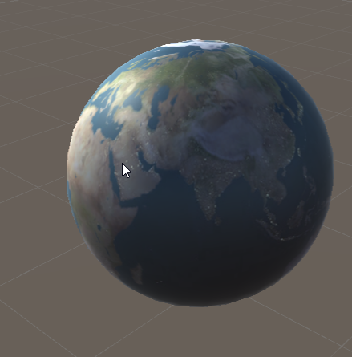

# Lab week 4

 

 Open the "week_04_textures" folder in Unity

 There is only one scene for this lab, called "Exercise 1". If you open it, you should see a simple sphere. 

 

 Let's give it a more interesting look by making it look like the earth. Start by downloading 'lab_04_assets.zip' from Toledo, you'll be using these files throughout the lab.

 Create a material and a lit (Standard Surface Shader) text shader, and set up the sphere to use them.

## Albedo

Import the albedo texture by dragging 'earth_albedo' onto your project view

 

You can now set it as the albedo texture used by your shader. A new shader already (optionally) supports using a texture for the albedo, so that's handy. Select your material, and set the texture in the inspector view.

 

You should see a result like the following : 

 

Unfortunately, it looks a bit flat. Open the the shader in your favorite text editor, and implement a day night cycle. 

Start by adding the 'earth_night.jpg' file to your assets. Also add an extra texture parameter to your shader's properties (in the shader text files) so you can set the texture. 

```
    _MainTex ("Albedo (RGB)", 2D) = "white" {}
    _NightTex ("Night Albedo (RGB)", 2D) = "white" {}
```

Set the texture on the material


 

Now, we need a way to decide when to use which texture. In fact, we'll always take the color value ('sample the texture') from both textures. Add code to your shader to sample the night texture. 

Declare a sampler first, as you'll need it when you call the texture sampling function. Remember, this is the glue between the properties at the top of the file, and your shader.

```
sampler2D _MainTex;
sampler2D _NightTex;
```

Let's do a quick sanity check by sampling the night texture, and outputting it directly as the color:

```
 o.Albedo = tex2D (_NightTex, IN.uv_MainTex);
```

Check that your render looks similar to mine: 

 


 ## Day Night Cycle

 We would like to realistically show the parts of earth that are currently in day, or in night. We need two things for that:

 1. A way to know how much "day" we are. We don't need to determine "night", as it's the inverse of "day. 
 2. A way to blend both textures depending on wether the location is currently experiencing day, or night

 ### Day or night?

 During the day, the sun is obviously above the horizon. During dusk and dawn, it's low, and it's relatively dark. During noon, the sun is quite high. Does this remind you of something?

 Yes, we have to calculate the dot product between the Normal and the Light again, as it tells us how similar the vector to the sun and the vector pointing perpendicular to our earth is. 

 We also need the normal. And this is pretty messy :(

 Unity autogenerates the vertex shader for us, but unfortunately it doesn't give us the normal. We'll have to write our own vertex shader, and pass the relevant information to our fragment shader. We can tell Unity we want a custom vertex shader by modifying 

```
#pragma surface surf Standard fullforwardshadows
```
 to 

```
#pragma surface surf Standard fullforwardshadows vertex:vert
```

That line promises to unity we'll implement the shader and call it **vert**. So let's implement it by adding the following code:

```
void vert(inout appdata_full v, out Input o)
{  
        UNITY_INITIALIZE_OUTPUT(Input,o);
        o.normal = UnityObjectToWorldNormal(v.normal);
}
```
Quite a lot happens here: 

1. We take the normal in the vertex. It's in object space. But we would like to have it in world space (as the sun direction is in world space). We transform it using a Unity macro *UnityObjectToWorldNormal*. Normally, we would get the *ObjectToWorldMatrix*, and then take care to transform the normal as a direction, but we'll take advantage of unity magic this time.
2. We write the normal to the output struct of our vertex shader. The rasterizer will interpolate it, and pass it to our fragment shader (called **surf**)

Don't forget to extend the **Input** struct to have a normal field:

```
 struct Input
 {
     float2 uv_MainTex;
     float3 normal;
 };
```

Now, you should have access to the normal in your fragment shader. You should be able to calculate the dot product between the normal and the sun direction now. The sun direction can be accessed using **_WorldSpaceLightPos0**. Write the result of your dot product to the albedo of the output struct, and check your result.

 

 ### Putting it together

 We now have three 'ingredients'

 1. The color value if it would be day at a pixel
 2. The color value if it would be night at a pixel
 3. The dot product between normal and light (sun) direction, giving us an indication what time of day it is at a certain pixel

We're in luck. HLSL has a function called **lerp**, shorthand for *linear interpolate*. Simply put, it blends two values. The first arguments are *a* and *b*, and are the two values that are blended between. The third argument, s, decides how much both arguments should weigh to the result.

s = 0.5 takes the average between the two arguments
s = 0 returns a
s = 1.0 returns b
s = 0.2 returns a * 0.8 + b*0.2

In our case, we can use it by setting a and b to the colors of day and night, and by setting s to how much "dayness" we calculated with the dot product.

Try it yourself! Do keep in mind that the dot product goes from -1 to 1, and lerp expects a s value between 0 and 1.

Check your result:

 

 ## The earth is not flat

 But it looks really flat in our result :(

 We're going to add a normal map, based on a height map. Import "earth_height.jpg" into your asset folder. You do need to modify the import setting by selecting the texture and going to the Inspector window.

 
 

 Change the type to "Normal map". 

 We don't have a normal map (yet) though, we have a height map. Check the box called "Create from Grayscale". This tells unity to do the generation for us.
 
 

 The bumpiness parameter determines how "high" the heightmap is interpreted at. Remember to play with it a bit once you actually can see the result. Apply your changes, and go to your shader.

 1. Add a texture and a sampler for the normal map. The default texture for normal maps is "bump", not "white" as it is for color textures.
 2. Assign your height texture to the normal map slot on the material
 3. In your fragment shader, use the unity macro to read the normal from the texture, and assign it to your output

 ```
 o.Normal = UnpackNormal (tex2D (_NormalTex, IN.uv_MainTex));
 ```

 And check your result:


 


 ## Have some fun with it 

 This part is optional, it will not be graded

 Some ideas to make your earth even nicer:

 1. There are two textures in the asset folder related to clouds. You can add some clouds, but make sure to take into account transparency
 2. Add a skybox (make sure it's small, github classrooms get full fast)
 3. Use the "earth_oceans" texture to make the land less reflective. Refer to your week 1 labs to see what parameters for _Smoothness and _Metallic would look good for water and land.
 4. You can make the oceans reflect the skybox you created. Have a look at the [Unity example](https://docs.unity3d.com/Manual/SL-SurfaceShaderExamples.html)