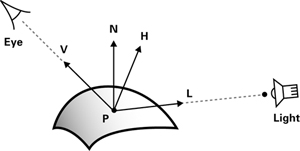
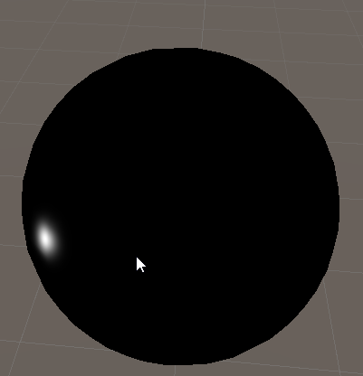
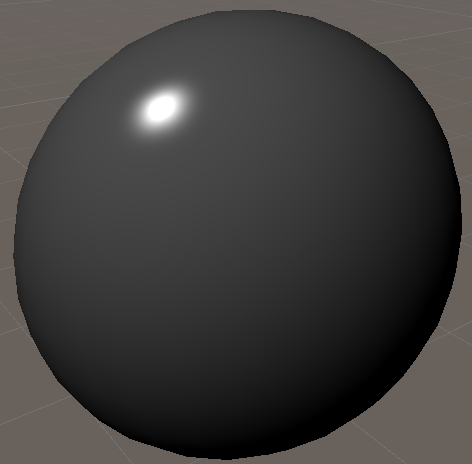
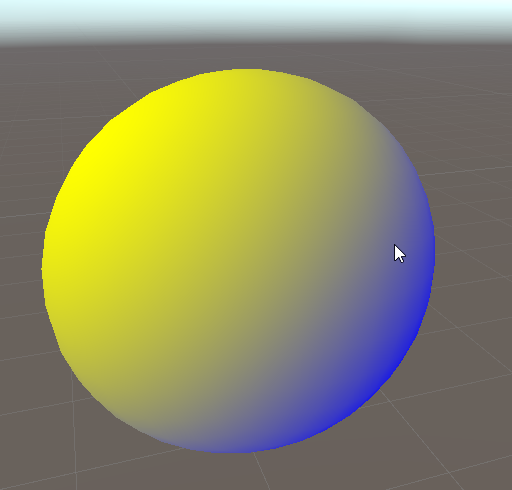
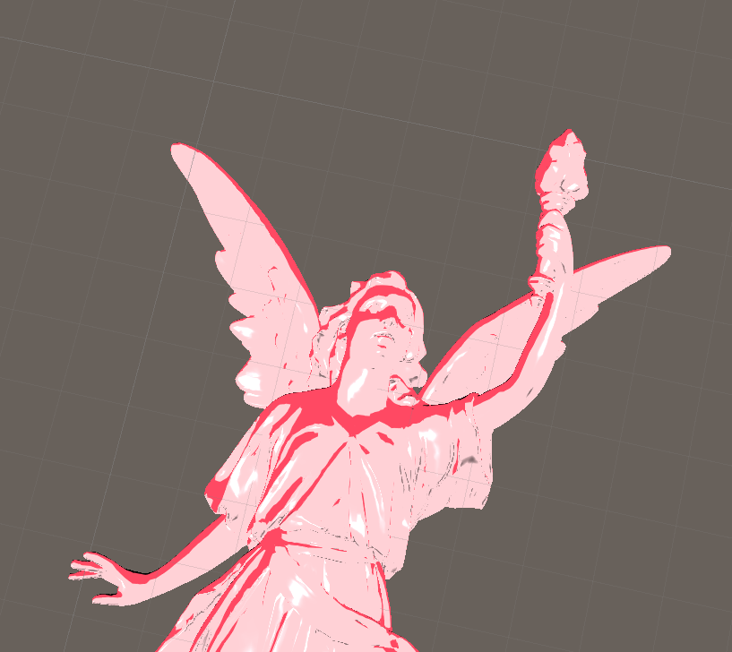

# Lab week 6

 Open the "week_06_materials" folder in Unity

 There is only one scene for this lab, called "Exercise 1". If you open it, you should see an empty scene.

 This lab, we're going to implement several materials.

## Blinn-Phong

Blinn Phong is a material (brdf) with both a diffuse and a specular component. It's also historically very important: it's a computationally simple model, and was the mainstay of real-time rendering from the early nineties until about 2007. Not a bad lifetime!

Start by creating an unlit shader, and a material. Don't forget to assign the shader to the material, and the material to a sphere that you create.

### Diffuse

Let's start with the diffuse component. We've done this before in week 4: it's simply

```
float diffuse component = dot(N,L);
```
You will still need to 

* Pass the normal from the vertex shader to the fragment shader
* Add a parameter to access the direction of the light ()

Check the labs of week 4 for details, it's exactly the same code.

### Specular

The formula for specular is 

 specular = Ks x lightColor x facing x pow((max(N · H, 0)), shininess)

where:

* "." is not multiplication, but the dot product
* Ks is the material's specular color,
* lightColor is the color of the incoming specular light,
* N is the normalized surface normal,
* V is the normalized vector toward the viewpoint,
* L is the normalized vector toward the light source,
* H is the normalized vector that is halfway between V and L,
* P is the point being shaded, and
* facing is 1 if N · L is greater than 0, and 0 otherwise.



Add the specular color as a parameter. Often this is set to white (different from the objects albedo, or base color), as specular is a reflection of the environment (lights).

Note that this formula does use V, or the vector from the object to the camera. You can get the world space camera position from the [builtin variables](https://docs.unity3d.com/Manual/SL-UnityShaderVariables.html) and construct the view vector from that (you still need to use the position from the vertex shader and transform it into the correct space.)

Check your specular results



Add your diffuse and your specular component together. Use a weighing factor to change the strength of both components (and make them parameters).

'''
float3 color = diffuseWeight * diffuse + specularWeight * specular;
'''
And you should be done!



Give yourself a pat on the back, blinn-phong is a very important material, and is a rite of passage for all graphics programmers.


## Gooch shading

Make a new sphere, material, and shader. We're going to implement Gooch shading, a very simple NPR (non photorealtic rendering) material.

Gooch shading makes the darker parts of a material colored rather that black. Traditionally a cool color (suck as blue or purple is used), contrasted with a warmer color such as yellow.

The algorithm is as follows:

* Use a standard lambert diffuse (dot(N, L))
* The result of this calculation falls in [-1, 1]
* Remap this result to [0, 1] (you will need to use a multiplication and an addition)
* Use your new result to interpolate (**lerp** function) between your two colors 



The sphere doesn't really show off our result well. Feel free to find a nice model to showcase it, but keep it under 1 Mb so the github classroom doesn't blow up :)

## Cell shading

Another non-realistic model is cell shading. This make everything look like the were handdrawn.

As always, make a sphere, material, and shader.


The idea is very simple:

In gooch shading, we remapped out lambert diffuse to [0, 1]. Instead of interpolating linearly between two colors, we use that to sample a lookup texture.


A lookup texture describes describes an indirection : we don't hardcode the colors, and by making it a texture, we enabled artists to do it.

It's specifically one dimensional: the colors change across x, but are constant in y. You can use a 1D texture for this, but a 2D texture can do in a pinch. 

Less abstractly, we implemented a ramp texture : from left to right it shows the response the material will have as the diffuse component gets larger.

To make the cell shading look, try having several blocks of solid color (don't just use my ramps). You can implement the shader first, that way you see the results under real lighting.

The algorithm:

* Remap the diffuse component to [0, 1] like you did for Gooch shading
* Use that to sample your lookup texture

Here is my result. It shows it off poorly, I made the bright parts to wide in the lookup texture :/



## Final test

Don't forget to rotate the directional light, rotate and translate your objects, and move your camera to verify your solution is correct (using the wrong space can look correct "by accident")