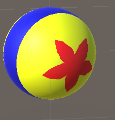

# Lab week 7

This lab, we're going to implement procedural shapes and geometry (specifically terrain). 

## Exercise 1 : Procedural shapes

For our first lab, open the scene called *Exercise 1*.

Refer to the image above of the yellow ball. Using the ball and shader provided, make our ball look the same : yellow with a  blue band in the middle, with a 5 pointed red star on both ends. Do not use textures, only shader code.

Note I had some trouble getting the stars to look good, which I think is due to the sphere mesh being a bit wonky. Don't worry too much, as long as you have a 5 pointed shape you're good.

Please check the slides of class 9a for some hints on how to solve this.

## Exercise 2 : Procedural geometry

For our second lab, open the scene called *Exercise 2*.

For this exercise, we're going to create some terrain using the fBm algorithm. You can read up on fBm at [Inigo Quillez's website](https://iquilezles.org/articles/fbm/). Don't worry about understanding everything on that page, but do keep note that it has some pseudocode for fBm.

### Grid creation

We have a bit of a challenge when doing this. I started out by adding some noise to a texture. 

I generated the texture by using the function 'Mathf.PerlinNoise'. Perlin noise is slightly different than the Value noise we saw in class, but it is very similar : a grid of random values, and interpolation of the value between the grid points.

My next step was to use this texture in my shader, to change the height of the point in my grid. This is an implementation of heightMapping : where the value of the texture is high (white), the height will be high, and low values (black) will be low. 
 

We see that our implementation works: our mesh is deformed according to the texture. But it's way to block. The reason is that Unity's standard Plane that we've been using, doesn't have enough triangles to make smooth hills and craggy mountains.

We can see the triangles in the plane more obviously if we enable Unity's wireframe mode in the Scene View. Click the sphere with a cross on it, and select either of the options (Shaded wireframe / Wireframe). Remember this function, it will be very useful in the rest of this lab.

The best way to solve this is by creating our own grid mesh. We could export one from a 3D content creation application like blender, but we're going to do it in code. That allows us to parameterize it, as in we can choose how many triangles we want in our grid as an argument to our script.

Create a script and attach it to the plane in the scene.

It's always a good idea to do things in small steps. We need a grid, which is a 2d array of squares. A square is made by 2 triangles. The simplest thing we can implement is therefor a triangle. This is of course no surprise, we've learned before that everything is made out of triangles!

First, we need to create a mesh, and learn how to create vertices and indices. The Unity documentation shows you how to do it.

[Mesh documentation](https://docs.unity3d.com/ScriptReference/Mesh.html)

For now, you will only need to fill in the positions of the vertices, and the indices.

     Vector3[] newVertices = new Vector3[]
     {
         new Vector3(0.0f,0.0f,0.0f),
         new Vector3(0.0f, 0.0f, 1.0f),
         new Vector3(1.0f, 0.0f, 0.0f)
     }

You will still need to create indices. Every vertex is only used once, but you have to be careful about the order due to the winding of the triangle. If you don't see anything, try changing the order of your indices.

If you did everything correctly, you should see a result like mine:

Perhaps a bit underwhelming, but it means we can create meshes!

The next step is to make a square. You'll need 4 vertices and 6 indices. Your result should look like this:

Now comes the hard part. We want to make a grid of square, and we want amount of squares to be dynamic. For example, we want to be able to generate a grid of 2x2 squares, and four in total. Because vertices are shared, we would 3x3 = 9 vertices. We still need 6 indices per square, so 2x2x6 = 24 indices.

Write code that generates the grid. You will want to have 3 parameters:

 * Vector2Int dimensions : the amount of squares in each dimension
 * Vector3 boundMin : the coordinate of the lower left corner of your grid
 * Vector3 boundMax : the coordinate of the upper right corner of your grid

A smart way to start is to take a screenshot of the vertices and indices you made for the single square. Change your generation code to generate multiple squares, but call it to generate only one square (set dimensions to (1,1)). Your generated indices and vertices should be identical to the ones you made for the single square.

It'll be hard to see if your code works, but remember the wireframe mode, it will make it clear if you're correct.

### Height creation

We've only generated the x and z coordinate for now, as the y coordinate is constant. Let's change that. We can call [Unity's perlin noise](https://docs.unity3d.com/ScriptReference/Mathf.PerlinNoise.html) while generating our vertices, and using the result of that function to change the height. You can multiply the return value to make it change height more or less. You can also try to multiply the coordinate you give it by a constant to make the bumps and valleys occur more often.

Please ignore the color white and the darker spots in the next image. I also overlayed a grid in my implementation to show height differences, but wireframe should serve you equally well.

This is an interesting result, but not what we're looking for. There are hills and valleys, but they're all the same size. We need to implement fBm, which is perlin noise added iteratively.

The idea is simple

* Loop n times (eg 8)
* At each iteration, generate a height using Perlin noise, and add it to a result float. Later iterations should contribute less to the final height
*  At each iteration, make the scale smaller (multiply the coordinate you use by a certain value). This will make the bumps occur more often on the same distance[]

In essence we create many layers of perlin noise: early ones will have large, high bumps. These are the base shape for mountains and valley. Later layers will have smaller bumps that are less high, creating smaller detail.

My results looks like this : 

Not a very exiting result, but it does work: we have bigger hills, as well as smaller detail. It also looks *plausible*, which means it might not exist in real life, but you could accept it as something realistic.

You can spend a lot of time tweaking your result that looks more dramatic. A simple thing to try would be to feed your result form fBm to a function. An example would be some [Tweaking functions that Perlin himself uses](http://demofox.org/biasgain.html). For example, using the bias function with a value of .3 would push our vertices down, making our mountain tops stand out more.

As a final step, add some colors to your terrain. I used white on the high parts to simulate snow, green on the lower points to simulate grass. It's not pretty, but it looks a bit more interesting. 

Note that your result will look more flat. That's because we've ignored that most important thing for lighting: normals.

It's a bit annoying to generate normals, so I'm fine with you leaving your result as is. The next part will not be graded (you won't get extra points).

But if you do want to fix it, I've used a shortcut (shortcut = incorrect but looks ok) to generate mine.

    Vector3 cross = Vector3.Cross(
        left - center,
        bottom - center
        );
    Vector3 normal = cross.normalized; 

Where center is the vertex I want to calculate the normal of, left is the vertex left of it, and bottom the vertex under it.

Because I know the height of left and bottom and center, I know their position in 3d space. As we've seen, the normal of a triangle is create by the cross product of it's 3 vertices. I cheat by saying the normal of a vertex is the same, which isn't correct but comes close. 